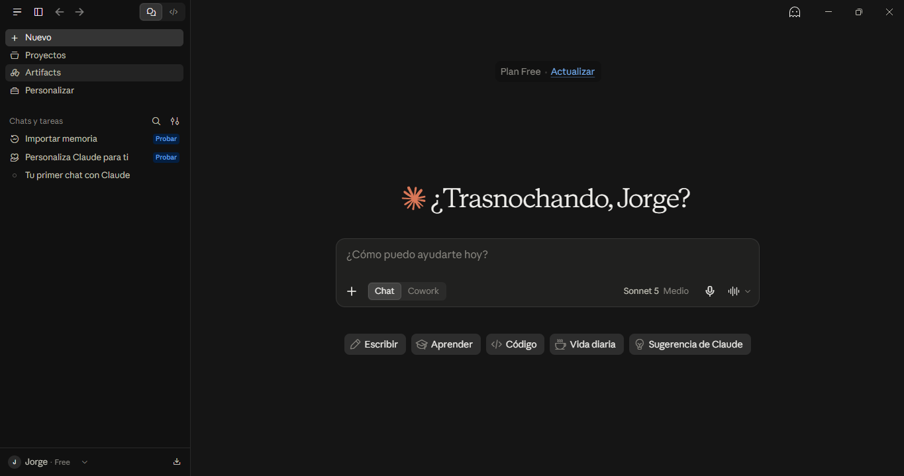
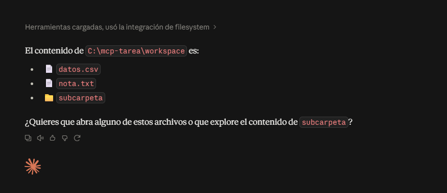
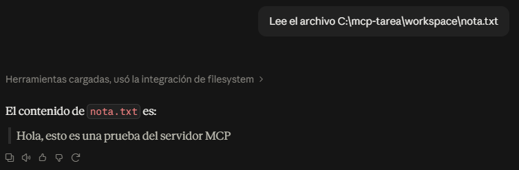
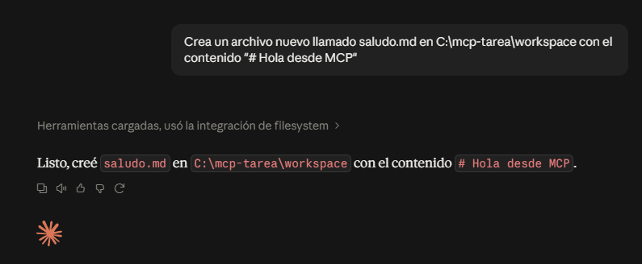
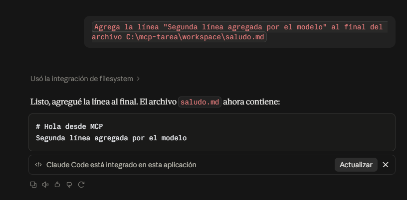
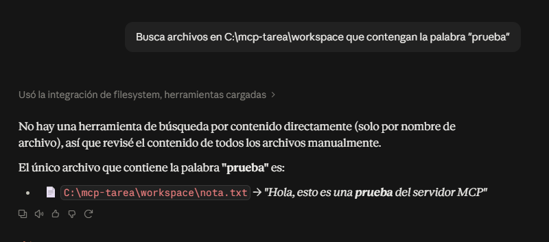
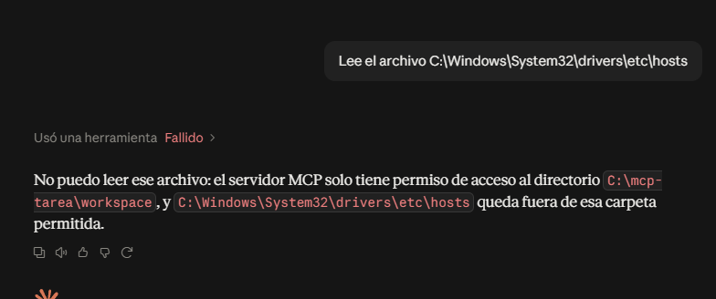

# Actividad MCP: Servidor de Sistema de Archivos

**Nombre:** Jorge López Ávila
**Boleta:** 2023630534
**Grupo:** 7CV4
**Fecha:** 22/09/2026

---

## Resumen

En esta actividad investigué cómo un modelo de lenguaje pasa de estar aislado a poder operar sobre archivos locales mediante el Model Context Protocol (MCP). Instalé el servidor de sistema de archivos oficial en Claude Desktop, configuré un directorio de trabajo limitado, verifiqué las herramientas que expone y documenté cada paso con capturas de pantalla. También realicé una prueba del límite de seguridad para comprobar que el servidor rechaza accesos fuera del directorio autorizado.

El trabajo se divide en dos partes: una investigación teórica sobre la evolución de los modelos, el aislamiento, MCP frente a las APIs, la arquitectura del protocolo, el servidor de filesystem, la seguridad y casos de uso reales; y una implementación práctica que consistió en dejar funcionando el servidor en mi propia máquina.

---

## Índice de documentos

| Documento | Tema |
|---|---|
| [01 - Evolución de los modelos](docs/01-evolucion-modelos.md) | LM, LLM y razonamiento explícito |
| [02 - Aislamiento](docs/02-aislamiento.md) | Por qué un LLM no ve archivos |
| [03 - MCP vs API](docs/03-mcp-vs-api.md) | Comparativa detallada |
| [04 - Arquitectura MCP](docs/04-arquitectura-mcp.md) | Host, cliente, servidor y transportes |
| [05 - Servidor FS](docs/05-servidor-fs.md) | Herramientas y alcance |
| [06 - Seguridad](docs/06-seguridad.md) | Riesgos y mitigaciones |
| [07 - Casos de uso](docs/07-casos-uso.md) | Herramientas que implementan MCP |

---

## Tabla comparativa: MCP frente a una API

| Criterio | API tradicional | MCP |
|---|---|---|
| Quién decide qué se invoca | El desarrollador, en el código | El modelo, en tiempo de ejecución |
| Descubrimiento de capacidades | Leyendo documentación, endpoints fijos | Catálogo dinámico que el modelo consulta |
| Acoplamiento cliente-servicio | Alto: cada endpoint está escrito de antemano | Bajo: el cliente descubre las herramientas |
| Formato de mensajes | Varía (REST, JSON, gRPC, SOAP) | JSON-RPC 2.0 estandarizado |
| Autenticación y consentimiento | Definida por el desarrollador | Gestionada por el host MCP |
| Reutilización entre aplicaciones | Baja: cada app integra su propia API | Alta: un servidor sirve a varios clientes |
| Rol del servidor | Expone endpoints | Expone herramientas, recursos y plantillas de prompt |

---

## Entorno utilizado

- **Sistema operativo:** Windows 11
- **Shell:** Git Bash (MINGW64)
- **Node.js:** v24.20.0
- **npm:** 11.19.0
- **Git:** 2.55.0.windows.5
- **Cliente MCP:** Claude Desktop (versión instalada desde Microsoft Store)
- **Servidor MCP:** @modelcontextprotocol/server-filesystem
- **Especificación MCP consultada:** versión 2025-06-18

---

## Instalación paso a paso

### 1. Verificar Node.js y npm

Abrir Git Bash y ejecutar:

node --version
npm --version

En mi caso devolvieron v24.20.0 y 11.19.0. Si no están instalados, descargar la versión LTS desde https://nodejs.org/ marcando la casilla "Add to PATH".

### 2. Instalar el servidor MCP de filesystem

npm install -g @modelcontextprotocol/server-filesystem

Esto instala el servidor en C:\Users\Jorge\AppData\Roaming\npm\mcp-server-filesystem.cmd.

### 3. Crear el directorio de trabajo

mkdir -p /c/mcp-tarea/workspace

Este será el único directorio al que el modelo tendrá acceso. No usar la raíz del disco ni la carpeta de usuario completa.

### 4. Instalar Claude Desktop

Descargar desde https://claude.ai/download e instalar. Iniciar sesión con una cuenta de Anthropic (la versión gratuita funciona para MCP).

### 5. Configurar la extensión MCP

La versión de Claude Desktop instalada desde Microsoft Store usa un sistema de extensiones (.mcpb / .dxt) en lugar del archivo claude_desktop_config.json clásico. Para agregar el servidor:

1. Abrir Claude Desktop
2. Ir a Configuración, Extensiones, Configuración avanzada
3. Clic en "Instalar extensión sin empaquetar"
4. Seleccionar la carpeta C:\mcp-tarea\extension-filesystem

El contenido del manifiesto es:

{
  "manifest_version": "0.2",
  "name": "filesystem",
  "display_name": "Sistema de Archivos",
  "version": "1.0.0",
  "description": "Servidor MCP de sistema de archivos limitado a un directorio de trabajo.",
  "author": {
    "name": "Jorge"
  },
  "server": {
    "type": "node",
    "entry_point": "server.js",
    "mcp_config": {
      "command": "C:\\Users\\Jorge\\AppData\\Roaming\\npm\\mcp-server-filesystem.cmd",
      "args": [
        "C:\\mcp-tarea\\workspace"
      ]
    }
  }
}

### 6. Verificar la instalación

En Claude Desktop, abrir un chat nuevo y pedir:

Lista el contenido del directorio C:\mcp-tarea\workspace

Claude debe pedir aprobación para usar la herramienta list_directory y luego devolver la lista de archivos.

---

## Evidencias

### Instalación de Claude Desktop

### Operación 1: Listar directorio

Petición: Lista el contenido del directorio C:\mcp-tarea\workspace

### Operación 2: Leer archivo

Petición: Lee el archivo C:\mcp-tarea\workspace\nota.txt

### Operación 3: Crear archivo

cat > /c/mcp-tarea/README.md << 'EOF'
# Actividad MCP: Servidor de Sistema de Archivos

**Nombre:** Jorge López Ávila
**Boleta:** 2023630534
**Grupo:** 7CV4
**Fecha:** 22/09/2026

---

## Resumen

En esta actividad investigué cómo un modelo de lenguaje pasa de estar aislado a poder operar sobre archivos locales mediante el Model Context Protocol (MCP). Instalé el servidor de sistema de archivos oficial en Claude Desktop, configuré un directorio de trabajo limitado, verifiqué las herramientas que expone y documenté cada paso con capturas de pantalla. También realicé una prueba del límite de seguridad para comprobar que el servidor rechaza accesos fuera del directorio autorizado.

El trabajo se divide en dos partes: una investigación teórica sobre la evolución de los modelos, el aislamiento, MCP frente a las APIs, la arquitectura del protocolo, el servidor de filesystem, la seguridad y casos de uso reales; y una implementación práctica que consistió en dejar funcionando el servidor en mi propia máquina.

---

## Índice de documentos

| Documento | Tema |
|---|---|
| [01 - Evolución de los modelos](docs/01-evolucion-modelos.md) | LM, LLM y razonamiento explícito |
| [02 - Aislamiento](docs/02-aislamiento.md) | Por qué un LLM no ve archivos |
| [03 - MCP vs API](docs/03-mcp-vs-api.md) | Comparativa detallada |
| [04 - Arquitectura MCP](docs/04-arquitectura-mcp.md) | Host, cliente, servidor y transportes |
| [05 - Servidor FS](docs/05-servidor-fs.md) | Herramientas y alcance |
| [06 - Seguridad](docs/06-seguridad.md) | Riesgos y mitigaciones |
| [07 - Casos de uso](docs/07-casos-uso.md) | Herramientas que implementan MCP |

---

## Tabla comparativa: MCP frente a una API

| Criterio | API tradicional | MCP |
|---|---|---|
| Quién decide qué se invoca | El desarrollador, en el código | El modelo, en tiempo de ejecución |
| Descubrimiento de capacidades | Leyendo documentación, endpoints fijos | Catálogo dinámico que el modelo consulta |
| Acoplamiento cliente-servicio | Alto: cada endpoint está escrito de antemano | Bajo: el cliente descubre las herramientas |
| Formato de mensajes | Varía (REST, JSON, gRPC, SOAP) | JSON-RPC 2.0 estandarizado |
| Autenticación y consentimiento | Definida por el desarrollador | Gestionada por el host MCP |
| Reutilización entre aplicaciones | Baja: cada app integra su propia API | Alta: un servidor sirve a varios clientes |
| Rol del servidor | Expone endpoints | Expone herramientas, recursos y plantillas de prompt |

---

## Entorno utilizado

- **Sistema operativo:** Windows 11
- **Shell:** Git Bash (MINGW64)
- **Node.js:** v24.20.0
- **npm:** 11.19.0
- **Git:** 2.55.0.windows.5
- **Cliente MCP:** Claude Desktop (versión instalada desde Microsoft Store)
- **Servidor MCP:** @modelcontextprotocol/server-filesystem
- **Especificación MCP consultada:** versión 2025-06-18

---

## Instalación paso a paso

### 1. Verificar Node.js y npm

Abrir Git Bash y ejecutar:

node --version
npm --version

En mi caso devolvieron v24.20.0 y 11.19.0. Si no están instalados, descargar la versión LTS desde https://nodejs.org/ marcando la casilla "Add to PATH".

### 2. Instalar el servidor MCP de filesystem

npm install -g @modelcontextprotocol/server-filesystem

Esto instala el servidor en C:\Users\Jorge\AppData\Roaming\npm\mcp-server-filesystem.cmd.

### 3. Crear el directorio de trabajo

mkdir -p /c/mcp-tarea/workspace

Este será el único directorio al que el modelo tendrá acceso. No usar la raíz del disco ni la carpeta de usuario completa.

### 4. Instalar Claude Desktop

Descargar desde https://claude.ai/download e instalar. Iniciar sesión con una cuenta de Anthropic (la versión gratuita funciona para MCP).

### 5. Configurar la extensión MCP

La versión de Claude Desktop instalada desde Microsoft Store usa un sistema de extensiones (.mcpb / .dxt) en lugar del archivo claude_desktop_config.json clásico. Para agregar el servidor:

1. Abrir Claude Desktop
2. Ir a Configuración, Extensiones, Configuración avanzada
3. Clic en "Instalar extensión sin empaquetar"
4. Seleccionar la carpeta C:\mcp-tarea\extension-filesystem

El contenido del manifiesto es:

{
  "manifest_version": "0.2",
  "name": "filesystem",
  "display_name": "Sistema de Archivos",
  "version": "1.0.0",
  "description": "Servidor MCP de sistema de archivos limitado a un directorio de trabajo.",
  "author": {
    "name": "Jorge"
  },
  "server": {
    "type": "node",
    "entry_point": "server.js",
    "mcp_config": {
      "command": "C:\\Users\\Jorge\\AppData\\Roaming\\npm\\mcp-server-filesystem.cmd",
      "args": [
        "C:\\mcp-tarea\\workspace"
      ]
    }
  }
}

### 6. Verificar la instalación

En Claude Desktop, abrir un chat nuevo y pedir:

Lista el contenido del directorio C:\mcp-tarea\workspace

Claude debe pedir aprobación para usar la herramienta list_directory y luego devolver la lista de archivos.

---

## Evidencias

### Instalación de Claude Desktop

### Operación 1: Listar directorio

Petición: Lista el contenido del directorio C:\mcp-tarea\workspace

### Operación 2: Leer archivo

Petición: Lee el archivo C:\mcp-tarea\workspace\nota.txt

### Operación 3: Crear archivo

Petición: Crea un archivo nuevo llamado saludo.md en C:\mcp-tarea\workspace con el contenido "# Hola desde MCP"

### Operación 4: Modificar archivo

Petición: Agrega la línea "Segunda línea agregada por el modelo" al final del archivo C:\mcp-tarea\workspace\saludo.md

### Operación 5: Buscar archivo

Petición: Busca archivos en C:\mcp-tarea\workspace que contengan la palabra "prueba"

En esta operación el modelo aclaró que el servidor de filesystem no tiene una herramienta de búsqueda por contenido, así que leyó los archivos manualmente hasta encontrar la coincidencia en nota.txt.

### Prueba del límite de seguridad

Petición: Lee el archivo C:\Windows\System32\drivers\etc\hosts

El servidor rechazó la operación porque el archivo está fuera del directorio autorizado. El modelo devolvió el mensaje: "el servidor MCP solo tiene permiso de acceso al directorio C:\mcp-tarea\workspace, y C:\Windows\System32\drivers\etc\hosts queda fuera de esa carpeta permitida".

---

## Conclusiones

La parte que más me costó entender al principio fue la diferencia entre MCP y una API. Al inicio pensaba que MCP era simplemente otra forma de llamar servicios, pero al instalar el servidor de filesystem me quedó claro que la diferencia está en quién decide qué se ejecuta. Con una API tradicional, yo como desarrollador tengo que escribir en el código qué endpoint llamar y cuándo. Con MCP, el modelo lee un catálogo de herramientas y decide por sí mismo cuál usar según la petición del usuario. Eso cambia por completo la forma de integrar IA en herramientas.

Otra cosa que me sorprendió fue la prueba del límite de seguridad. El servidor rechazó el acceso a C:\Windows\System32\drivers\etc\hosts de forma automática, sin que yo tuviera que configurar nada especial. Basta con declarar el directorio permitido al configurar el servidor y todo lo que esté fuera queda bloqueado. Entiendo ahora por qué se insiste en que el alcance limitado es una de las mitigaciones más importantes: sin ese límite, un modelo con acceso al filesystem podría leer o modificar cualquier archivo del sistema si un atacante logra inyectarle instrucciones maliciosas a través del contenido de un archivo.

También noté que la versión de Claude Desktop instalada desde Microsoft Store usa un sistema de extensiones distinto al clásico claude_desktop_config.json que aparece en la mayoría de tutoriales. Tuve que investigar un poco para descubrir que se podía instalar la extensión desde la interfaz con el botón "Instalar extensión sin empaquetar" apuntando a una carpeta con el manifiesto. Esta experiencia me sirvió para entender que MCP está evolucionando rápido y que las herramientas cambian de versión con frecuencia.

---

## Referencias

Anthropic. (2025). Claude Desktop [Software]. https://claude.ai/download

Model Context Protocol. (2025). Specification (Version 2025-06-18). https://modelcontextprotocol.io/specification/2025-06-18

Model Context Protocol. (2025). Filesystem MCP Server. GitHub. https://github.com/modelcontextprotocol/servers/tree/main/src/filesystem

Google. (2025). Antigravity [Software]. https://antigravity.google/

Cursor. (2025). Cursor - The AI Code Editor [Software]. https://cursor.com/

Alibaba Cloud. (2025). Qwen Code [Software]. https://github.com/QwenLM/qwen-code
